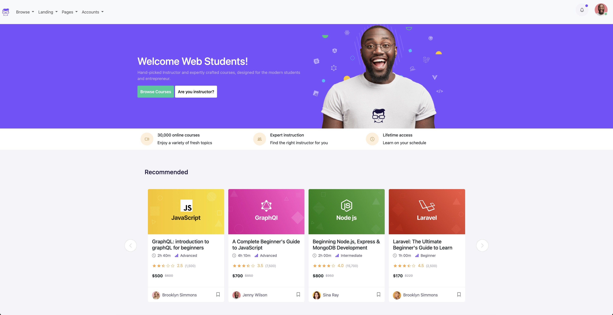

# Geeks UI Learning Platform Clone

<p align="center">
  <a href="https://github.com/EmanWeBdV/EPICODE_M3-W3D1">
    
  </a>
</p>

<p align="center">
  A responsive clone of a modern <strong>online learning platform</strong>, built with HTML and CSS.<br/>
  Focus on layout structure, responsive design, reusable card sections and clean UI composition.<br/>
  <strong>This project was created during Module M3 of the Epicode course.</strong>
</p>

<p align="center">
  <a href="https://github.com/EmanWeBdV/EPICODE_M3-W3D1">
    
  </a>
  <a href="https://github.com/EmanWeBdV/EPICODE_M3-W3D1/issues">
    
  </a>
  <a href="#">
    
  </a>
</p>

<p align="center">
  <a href="#-preview">Preview</a>
  ·
  <a href="#-demo">Demo</a>
  ·
  <a href="https://github.com/EmanWeBdV/EPICODE_M3-W3D1/issues">Report a bug</a>
  ·
  <a href="https://github.com/EmanWeBdV/EPICODE_M3-W3D1/issues">Request a feature</a>
</p>

---

## ✨ Preview
<p align="center">
  
</p>

---

## 🔗 Demo

If you publish the project with GitHub Pages, add the link here:

- **Live demo:** https://EmanWeBdV.github.io/EPICODE_M3-W3D1/

---

## 🧭 Table of Contents

- [Preview](#-preview)
- [Demo](#-demo)
- [Features](#-features)
- [Tech Stack](#-tech-stack)
- [Project Structure](#-project-structure)
- [Installation](#-installation)
- [Usage](#-usage)
- [Responsiveness](#-responsiveness)
- [Roadmap](#-roadmap)
- [Contributing](#-contributing)
- [Author](#-author)
- [License](#-license)
- [Disclaimer](#-disclaimer)

---

## 🚀 Features

- **Modern Educational Navbar**
  - Brand logo
  - Multiple dropdown navigation items such as _Browse_, _Landing_, _Pages_, and _Accounts_
  - User profile dropdown with account-related actions

- **Hero Section**
  - Main heading: **Welcome Web Students!**
  - Short introductory text for the platform
  - Call-to-action buttons:
    - _Browse Courses_
    - _Are you instructor?_
  - Hero illustration

- **Benefits Section**
  - Informative blocks highlighting platform strengths:
    - _30,000 online courses_
    - _Expert instruction_
    - _Lifetime access_

- **Course Sections**
  - **Most Popular**
  - **Trending**
  - Card-based layout for courses
  - Each card includes:
    - course image
    - title
    - duration
    - difficulty level
    - rating
    - price
    - instructor information

- **Responsive Layout**
  - Structured to adapt across different screen sizes
  - Focus on spacing, hierarchy and visual balance

- **Clean Static Version**
  - This version focuses on the visual structure and layout
  - No hover effects or advanced interactive enhancements yet

- **Educational Context**
  - Built as part of the **Epicode** learning path to practice frontend structure, section organization and UI replication

---

## 🧱 Tech Stack

<p align="left">
  
  
</p>

---

## 📂 Project Structure

```bash
.
├── index.html
├── .gitignore
├── assets
│   ├── css
│   │   └── stylescustom.css
│   └── image
│       ├── logo.svg
│       ├── avatar-1.jpg
│       ├── hero-img.png
│       └── ...other assets
└── README.md
